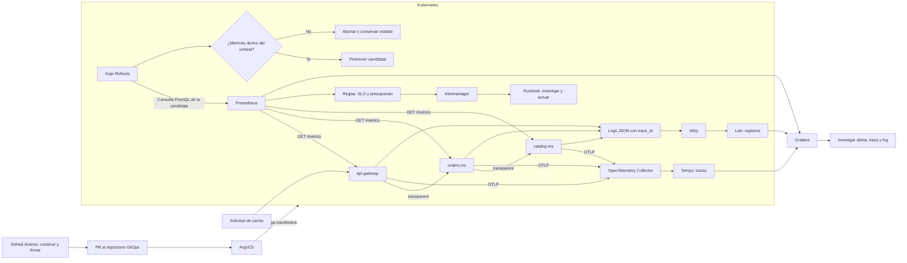

# Diagrama del flujo de telemetria

Las flechas de Prometheus hacia los servicios representan la recoleccion.
Las flechas hacia Grafana representan las fuentes consultadas por el tablero.

```mermaid
flowchart LR
    U[Solicitud de carrito] --> G[api-gateway]
    G -->|traceparent| O[orders-ms]
    O -->|traceparent| C[catalog-ms]
    subgraph Kubernetes
        G -->|OTLP| OT[OpenTelemetry Collector]
        O -->|OTLP| OT
        C -->|OTLP| OT
        OT --> T[Tempo: trazas]
        G --> L[Logs JSON con trace_id]
        O --> L
        C --> L
        L --> AL[Alloy]
        AL --> LK[Loki: registros]
        P[Prometheus] -->|GET /metrics| G
        P -->|GET /metrics| O
        P -->|GET /metrics| C
        P --> R[Reglas: SLO y presupuesto]
        R --> AM[Alertmanager]
        AM --> RB[Runbook: investigar y actuar]
        AR[Argo Rollouts] -->|Consulta PromQL de la candidata| P
        AR --> D{¿Metricas dentro del umbral?}
        D -->|Si| PR[Promover candidata]
        D -->|No| AB[Abortar y conservar estable]
    end
    P --> GF[Grafana]
    T --> GF
    LK --> GF
    GF --> I[Investigar alerta, traza y log]
    GH[GitHub Actions: construir y firmar] --> GP[PR al repositorio GitOps]
    GP --> AC[ArgoCD]
    AC -->|Despliega manifiestos| Kubernetes
```

