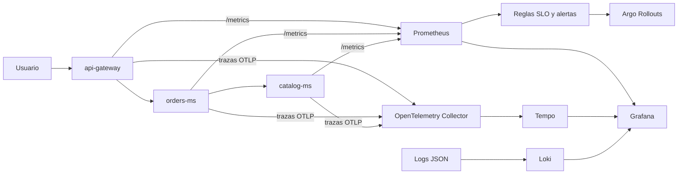

# Diagrama de telemetria

```mermaid
flowchart LR
    U[Usuario] --> G[api-gateway]
    G --> O[orders-ms]
    O --> C[catalog-ms]

    G -->|trazas OTLP| OT[OpenTelemetry Collector]
    O -->|trazas OTLP| OT
    C -->|trazas OTLP| OT
    OT --> T[Tempo]

    G -->|/metrics| P[Prometheus]
    O -->|/metrics| P
    C -->|/metrics| P
    P --> R[Reglas SLO y alertas]
    R --> A[Argo Rollouts]

    L[Logs JSON] --> LK[Loki]
    P --> GF[Grafana]
    T --> GF
    LK --> GF
```
